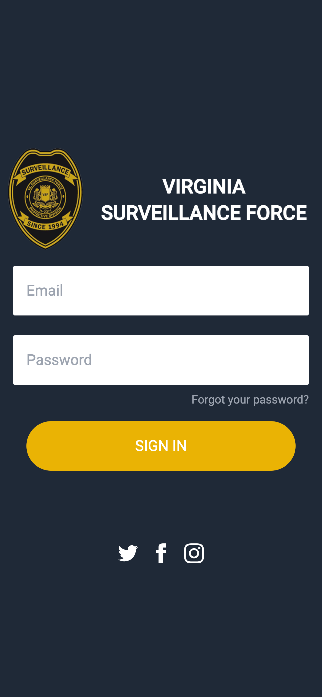
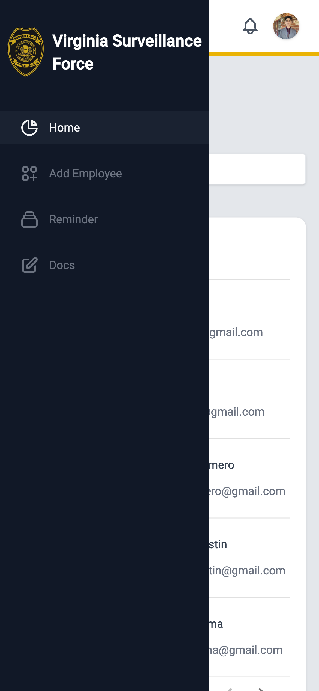
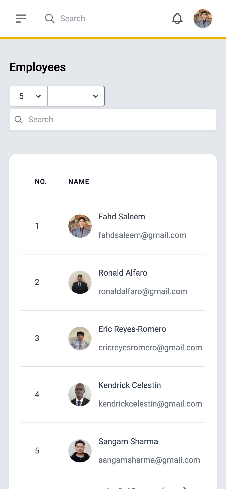
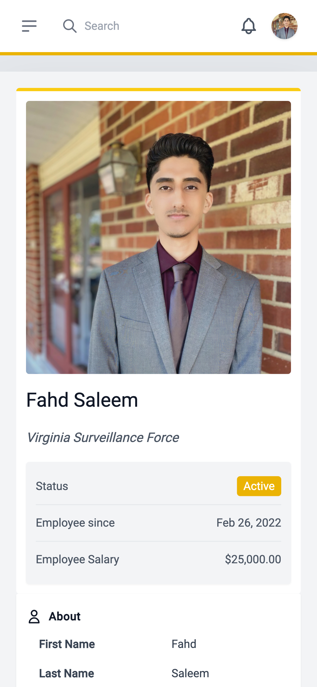
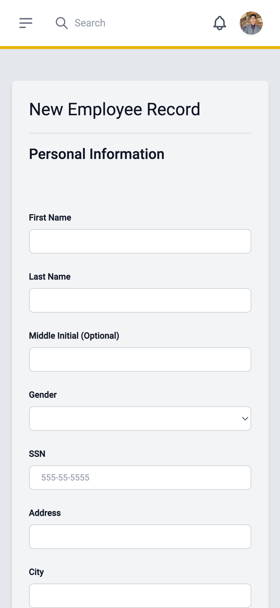
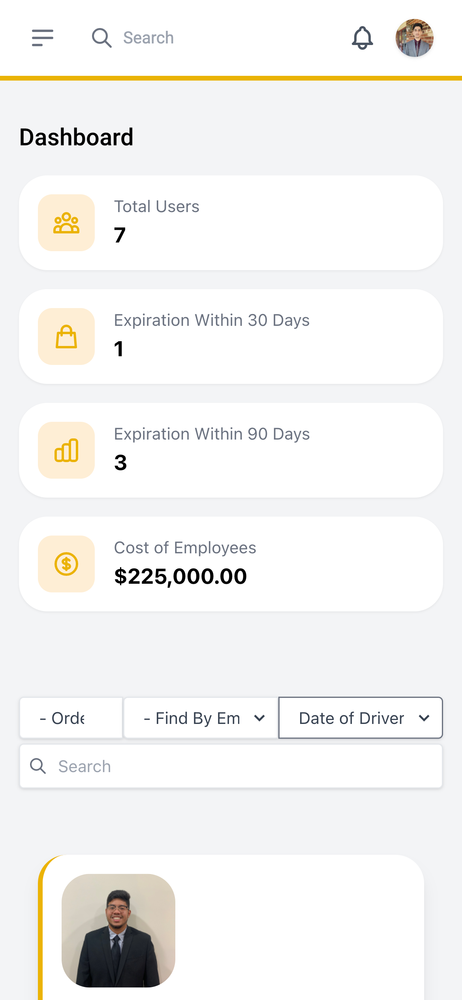

# Virginia Surveillance Force Company Solution

### Senior Capstone Project (Fall 2021 - Spring 2022)

* Online Solution for Security Guard/Patrol Officers with a focus on the implementation of a Database Management Solution (DBMS)
as well as an Employee Management System (EMS) with a facilitative web application & automated employee reminder system.

## Description

The following project is a solution developed for the company Virginia Surveillance Force, to better transition the company to an efficient integrated online solution for internal management and oversight of employees. 

## Components
* Login Page

* Home Page

* Employee Profile

* Dashboard & Automated Reminder System

* Add Employee Form

# Responsive Design

  
   
   

  
  
   

## Authors

Contributors names and contact info
Development Team: Bravo 4
Lead Developer: [@cFahd](https://github.com/cfahd/)

## Version History
* 0.1
    * Initial Release

## License

This project is licensed under cFahd - see the LICENSE file for details
